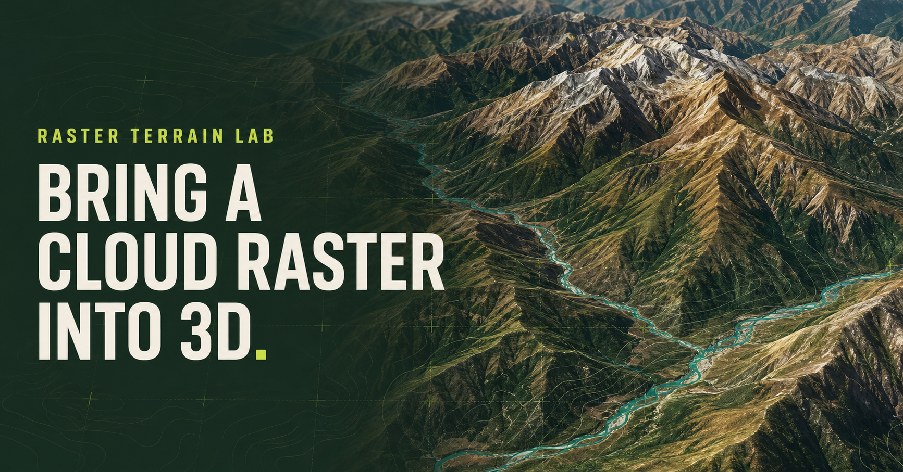
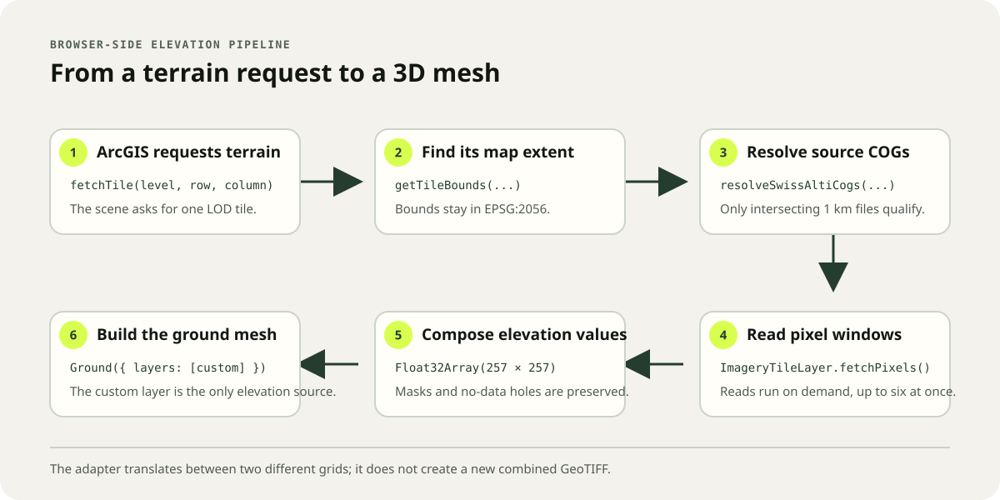

# Cloud-Optimized GeoTIFF for 3D Terrain

An experimental web application that uses the ArcGIS Maps SDK for JavaScript to open Cloud-Optimized GeoTIFFs (COGs) directly and turn collections of swissALTI3D elevation COGs into interactive 3D terrain in the browser.

[Open the live application](https://raster-terrain-lab.gianluca-miele.chatgpt.site) · [Read the technical guide](docs/3d-cog-viewer.md) · [Read the project summary](docs/cog-viewer-project-summary.md)



## Why this project

Following conversations at the Esri User Conference in San Diego with people working in earth observation, surveying, and defense, I wanted to explore the growing use of COGs across the geospatial community.

A COG remains a standard GeoTIFF, but its internal tiles and overviews allow compatible clients to retrieve only the required area and resolution through HTTP byte-range requests. This can reduce data transfer and, for suitable workflows, avoid publishing the data through a dedicated raster or imagery service.

This project tests that access model in two related scenarios:

- opening cloud-hosted imagery COGs directly in a 3D scene; and
- composing many elevation COGs into a continuous terrain surface on demand.

## What the application demonstrates

- Direct display of preset or user-provided imagery COGs.
- Browser-side terrain composition from 0.5 m swissALTI3D elevation COGs.
- Four selectable terrain catalogs: Zermatt, Zürich, Canton Bern, and Chur.
- A custom ArcGIS `BaseElevationLayer` that translates terrain-tile requests into COG pixel-window reads.
- On-demand source loading, bounded concurrency, caching, and preservation of no-data areas.
- A local Swiss LV95 scene in EPSG:2056 without coordinate reprojection or fallback world elevation.
- Two experimental terrain tiling profiles: a regional 256 px grid and the Swiss `elevation_suisse` cache grid.
- 3D analysis tools including measurements, line of sight, viewshed, cut-and-fill volume, elevation profile, and daylight.
- swissBUILDINGS3D context within the terrain scene.

## How the terrain pipeline works

1. ArcGIS requests an elevation tile from the custom terrain layer.
2. The application converts the tile address into an EPSG:2056 extent.
3. It identifies the 1 km swissALTI3D COGs intersecting that extent.
4. ArcGIS `ImageryTileLayer.fetchPixels()` reads only the required pixel windows.
5. Valid elevations are copied into one shared output grid.
6. ArcGIS turns that grid into the 3D ground mesh.



The crucial distinction is that a **source COG is not an ArcGIS terrain tile**. The COG is a persistent 1 km source dataset; the terrain tile is a temporary grid requested by the 3D view. The adapter translates between those grids and composes source values in memory—it does not create a new mosaic file.

For the implementation details, annotated code samples, cache lifecycle, seam handling, and explanatory drawings, see [3D COG Viewer: from Cloud-Optimized GeoTIFFs to terrain](docs/3d-cog-viewer.md).

## Data and spatial reference

| Property | Value |
| --- | --- |
| Elevation source | [swissALTI3D](https://www.swisstopo.admin.ch/en/height-model-swissalti3d) |
| Provider | Federal Office of Topography swisstopo |
| Source access | Direct HTTPS COG URLs on `data.geo.admin.ch` |
| Horizontal reference | EPSG:2056 — Swiss LV95 |
| Vertical reference | EPSG:5728 — LN02 |
| Source grid | 1 km × 1 km, 2,000 × 2,000 pixels |
| Native cell size | 0.5 m |
| Expected no-data value | `-9999` unless declared by the source |

The application currently catalogs:

| Region | COGs | Source years |
| --- | ---: | --- |
| Zermatt | 298 | 2024 |
| Zürich | 124 | 2019–2020 |
| Canton Bern | 6,380 | 2021 and 2025 |
| Chur | 114 | 2023 |

Source attribution: **Federal Office of Topography swisstopo**. See the [swisstopo terms of use for free geodata and geoservices](https://www.swisstopo.admin.ch/en/terms-of-use-free-geodata-and-geoservices).

## Run locally

### Prerequisite

- Node.js `>=22.13.0`

### Start the application

```bash
npm install
npm run dev
```

### Validate a change

```bash
npm run build
npm test
npm run lint
```

| Command | Purpose |
| --- | --- |
| `npm run dev` | Start the local vinext development server. |
| `npm run build` | Create the production build. |
| `npm test` | Build the app and run the Node test suite. |
| `npm run lint` | Run ESLint across the project. |

## Project structure

| Path | Responsibility |
| --- | --- |
| `app/page.tsx` | Application UI, ArcGIS scenes, layers, and 3D analysis tools. |
| `app/swissAltiSource.ts` | swissALTI3D region catalogs, source URLs, extents, and spatial lookup. |
| `app/swissAltiElevation.ts` | COG readers, metadata validation, caching, mosaicking, and the custom elevation layer. |
| `app/elevationSuisseScheme.ts` | EPSG:2056 `elevation_suisse` tiling-profile adapter. |
| `tests/` | Catalog, tiling, HTML, and terrain-behavior checks. |
| `docs/` | Technical guides, project context, and explanatory visuals. |

## Documentation

- [3D COG Viewer technical guide](docs/3d-cog-viewer.md) — illustrated explanation and annotated implementation samples.
- [Project summary](docs/cog-viewer-project-summary.md) — motivation, outcome, and AI-assisted workflow.
- [Sites and vinext starter reference](docs/sites-vinext-starter-reference.md) — optional hosting, D1, Drizzle, and ChatGPT authentication notes moved from the original starter README.

## Experimental scope

- Direct COG URLs in `ImageryTileLayer` are currently identified as a beta capability by the ArcGIS Maps SDK for JavaScript documentation.
- The terrain adapter intentionally expects aligned, single-band swissALTI3D sources in EPSG:2056 with a consistent 0.5 m grid.
- The source host must support HTTP byte-range requests and browser access through CORS.
- Network and memory use follow the current view, requested level of detail, and number of intersecting sources.
- COGs do not replace raster services in every situation. Services remain valuable for dynamic reprojection, processing, styling, mosaicking, access control, and standardized APIs.

## AI-assisted workflow

ChatGPT, Codex, and Sites supported the complete workflow: exploring the idea, implementing the application, testing it, producing documentation and diagrams, and deploying the result.

What stood out was the continuity between UI/UX, code, browser feedback, and local project files. The outputs remained regular, reviewable source files tracked in GitHub, while Sites provided a direct path from the working project to a deployed application.

**Idea → code → visual result → validation → documentation → deployed application**

## Software licensing

This repository does not currently declare a software license. Add an appropriate `LICENSE` file before redistributing or accepting external contributions to the source code.
