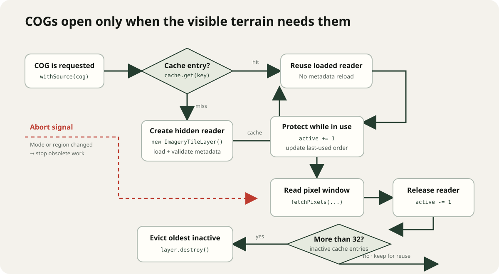
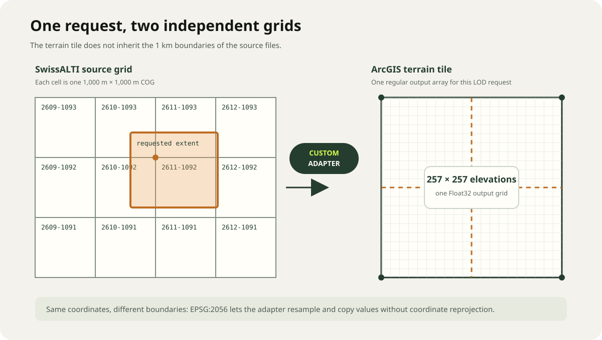
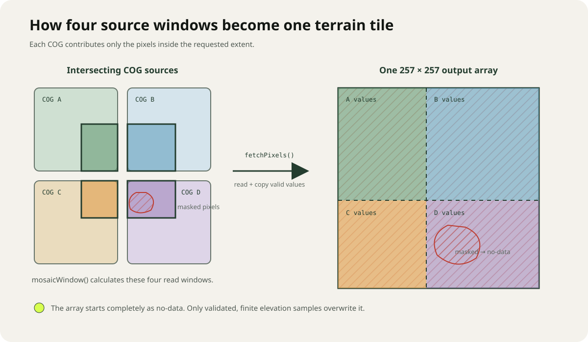
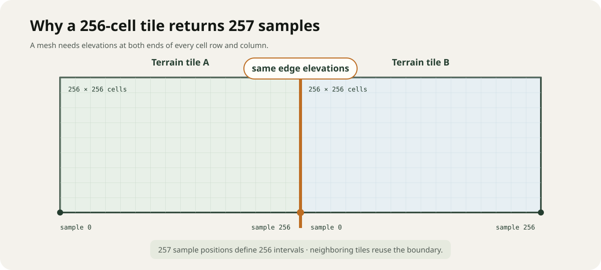

# 3D COG Viewer: from Cloud-Optimized GeoTIFFs to terrain

Version 2 — illustrated and code-focused

## Purpose

The 3D COG Viewer turns a regional collection of SwissALTI3D Cloud-Optimized GeoTIFFs (COGs) into one terrain surface in an ArcGIS local scene.

The application does this entirely in the browser:

1. ArcGIS asks the custom elevation layer for a terrain tile.
2. The application calculates that tile's geographic extent.
3. It finds the 1 km SwissALTI COGs intersecting the extent.
4. It reads only the required pixel window from each COG.
5. It copies the valid elevations into one output array.
6. ArcGIS uses that array to build the 3D ground mesh.


*The browser-side pipeline. The custom adapter connects ArcGIS terrain requests to direct COG pixel-window reads.*

The most important idea is that a **source COG is not an ArcGIS terrain tile**. A COG is a 1 km source dataset. A terrain tile is a temporary grid requested by the 3D view at a particular level, row, and column. The custom elevation layer translates between the two grids.

## Application source

The relevant files in the 3D viewer repository are:

| File | Responsibility |
| --- | --- |
| `app/swissAltiSource.ts` | Describes the COG catalog, constructs URLs and extents, and finds the COGs intersecting a terrain request. |
| `app/swissAltiElevation.ts` | Opens COGs, validates their metadata, reads pixel windows, caches sources, and implements the custom elevation layer. |
| `app/page.tsx` | Creates the terrain tiling scheme, attaches the custom layer to `Ground`, and initializes the local 3D scene. |
| `tests/swissalti-regional-catalog.test.mjs` | Checks catalog integrity and the important terrain-adapter connections. |
| `tests/rendered-html.test.mjs` | Checks that terrain mode remains local, uses EPSG:2056, and does not fall back to world elevation. |

The running example is available at [Raster Terrain Lab](https://raster-terrain-lab.gianluca-miele.chatgpt.site).

The samples below preserve the production flow but omit some TypeScript types, lifecycle checks, and concurrency code to keep the explanation readable. Use the application files above as the copy-paste source.

## Source-data assumptions

The adapter deliberately supports a narrow, consistent terrain dataset. Every accepted SwissALTI COG must have:

- horizontal spatial reference EPSG:2056 (Swiss LV95);
- vertical reference EPSG:5728 in the file naming convention;
- one elevation band;
- a 0.5 m cell size;
- a size of 2,000 × 2,000 pixels;
- a 1,000 × 1,000 m extent aligned to the Swiss kilometre grid; and
- `-9999` as the expected source no-data value when the raster does not publish another value.

These constraints are crucial. Because all sources use the same coordinate system, resolution, and grid alignment, the application can compose them without a reprojection step.

The current catalog contains four selectable regions:

- Zermatt: 298 COGs from 2024.
- Zürich: 124 COGs from 2019 and 2020.
- Canton Bern: 6,380 COGs from 2021 and 2025.
- Chur: 114 COGs from 2023.

## 1. Building and querying the COG catalog

The catalog stores each COG's URL and its expected extent. SwissALTI tile ID `2610-1092`, for example, covers easting 2,610,000–2,611,000 and northing 1,092,000–1,093,000 in EPSG:2056.

The production code constructs the source record instead of repeating full URLs:

```ts
const DATA_ROOT =
  "https://data.geo.admin.ch/ch.swisstopo.swissalti3d";

function createSwissAltiCog(year: number, eastKm: number, northKm: number) {
  const id = `${eastKm}-${northKm}`;
  const fileName = `swissalti3d_${year}_${id}_0.5_2056_5728.tif`;

  return {
    id,
    year,
    url: `${DATA_ROOT}/swissalti3d_${year}_${id}/${fileName}`,
    extent: {
      xmin: eastKm * 1_000,
      ymin: northKm * 1_000,
      xmax: (eastKm + 1) * 1_000,
      ymax: (northKm + 1) * 1_000,
    },
  };
}
```

When ArcGIS requests a terrain extent, `resolveSwissAltiCogs()` converts its minimum and maximum coordinates to kilometre-grid indices. It then performs direct map lookups such as `2610-1092` instead of scanning every URL.

```ts
function resolveSwissAltiCogs(region, extent) {
  const minEastKm = Math.floor(extent.xmin / 1_000);
  const maxEastKm = Math.floor((extent.xmax - 1e-7) / 1_000);
  const minNorthKm = Math.floor(extent.ymin / 1_000);
  const maxNorthKm = Math.floor((extent.ymax - 1e-7) / 1_000);
  const matches = [];

  for (let north = minNorthKm; north <= maxNorthKm; north += 1) {
    for (let east = minEastKm; east <= maxEastKm; east += 1) {
      const cog = region.cogById.get(`${east}-${north}`);
      if (cog) matches.push(cog);
    }
  }

  return matches;
}
```

**Crucial part:** subtracting a very small value from `xmax` and `ymax` prevents an extent ending exactly on a kilometre boundary from incorrectly selecting the next COG.

## 2. Opening and reading a COG

The application does not implement a TIFF parser. It creates an ArcGIS `ImageryTileLayer` whose URL points directly to a COG. ArcGIS loads the raster metadata and provides `fetchPixels()` for reading a requested geographic window.

The following sample is shortened from `loadSource()` and the pixel-read portion of `fetchTile()`:

```ts
// One hidden ArcGIS layer acts as a reader for one COG.
const sourceLayer = new ImageryTileLayer({
  url: cog.url,
  visible: false,
});

await sourceLayer.load({ signal });

const info = sourceLayer.serviceRasterInfo;
if (!info) throw new Error(`COG ${cog.id} has no raster metadata.`);

const wkid =
  info.spatialReference?.latestWkid ?? info.spatialReference?.wkid;
const pixelSizeX = Math.abs(info.pixelSize?.x ?? Number.NaN);
const pixelSizeY = Math.abs(info.pixelSize?.y ?? Number.NaN);

// CRUCIAL: reject a source that would break the zero-reprojection mosaic.
if (
  wkid !== 2056 ||
  pixelSizeX !== 0.5 ||
  pixelSizeY !== 0.5 ||
  info.width !== 2_000 ||
  info.height !== 2_000 ||
  info.bandCount !== 1
) {
  throw new Error(`COG ${cog.id} does not match the terrain grid.`);
}

// Later, read only the portion needed for one terrain request.
const result = await sourceLayer.fetchPixels(
  requestedSourceExtent,
  requestedWidth,
  requestedHeight,
  { signal },
);

const elevations = result.pixelBlock?.pixels?.[0];
const mask = result.pixelBlock?.mask;
```

`fetchPixels()` receives an extent and output dimensions. Its `PixelBlock` contains the elevation values for that window and may also contain a validity mask.

The application validates more than the shortened sample shows. It also checks the full extent, pixel dimensions, band count, pixel type metadata, and no-data value. Floating-point coordinate comparisons use a small tolerance rather than strict equality.

### On-demand source cache

The catalog can contain hundreds of COGs, but the application does not open all of them during startup.

- The first request for a COG creates and loads its hidden `ImageryTileLayer`.
- Later requests reuse the same layer.
- At most 32 inactive source layers remain cached.
- Active layers are protected from eviction.
- Old inactive layers are destroyed first.
- A terrain tile reads at most six sources concurrently.
- Abort signals cancel obsolete work when the user switches mode or region.



*A cache hit reuses the hidden reader. A miss creates and validates it; least-recently-used inactive readers are later removed when the cache exceeds its limit.*

**Crucial part:** the catalog is large, but memory and network use follow the visible terrain. Loading every COG in advance would make startup much heavier.

## 3. Defining the terrain grid

The 3D view needs a regular tiling scheme. `app/page.tsx` creates one for the selected region:

```ts
const spatialReference = new SpatialReference({ wkid: 2056 });
const lods = createElevationLods(metadata);

const tileInfo = new TileInfo({
  dpi: 96,
  format: "lerc",
  spatialReference,
  size: [256, 256],
  origin: new Point({
    x: metadata.extent.xmin,
    y: metadata.extent.ymax, // north-west corner
    spatialReference,
  }),
  lods,
});
```

The current LOD resolutions are derived from the native 0.5 m resolution. The configured factors descend from at most 32 to 1, giving the current regions resolutions of 16, 8, 4, 2, 1, and 0.5 m.

This grid belongs to the custom elevation layer. It is independent of the 1 km boundaries of the source COGs.



*Both grids use EPSG:2056, but their boundaries serve different purposes. The adapter selects the intersecting COGs and returns one regular terrain array.*

## 4. Composing an elevation tile from multiple COGs

The custom terrain layer extends ArcGIS `BaseElevationLayer` and implements `fetchTile(level, row, column)`. ArcGIS calls this method whenever the scene needs terrain data.

The production implementation can be summarized as follows:

```ts
const RegionalCogElevationLayer = BaseElevationLayer.createSubclass({
  async fetchTile(level, row, column, options) {
    // 1. Convert the ArcGIS tile address to an EPSG:2056 extent.
    const [xmin, ymin, xmax, ymax] = this.getTileBounds(
      level,
      row,
      column,
    );
    const requestExtent = { xmin, ymin, xmax, ymax };

    // 2. Elevation tiles use one extra edge sample: 256 + 1.
    const size = this.tileInfo.size[0] + 1;
    const values = new Float32Array(size * size);
    values.fill(ELEVATION_NO_DATA_VALUE);

    // 3. Route the request only to intersecting kilometre COGs.
    const cogs = resolveSwissAltiCogs(region, requestExtent);

    for (const cog of cogs) {
      // 4. Calculate where this COG intersects the output array.
      const window = mosaicWindow(requestExtent, cog.extent, size);
      if (!window) continue;

      await preparedCatalog.withSource(cog, options?.signal, async (source) => {
        // 5. Ask ArcGIS to read/resample just that COG window.
        const result = await source.layer.fetchPixels(
          new Extent({ ...window.extent, spatialReference: this.spatialReference }),
          window.width,
          window.height,
          { signal: options?.signal },
        );

        const pixels = result.pixelBlock?.pixels?.[0];
        const mask = result.pixelBlock?.mask;
        if (!pixels) return;

        // 6. Copy valid samples into their position in the terrain tile.
        for (let i = 0; i < pixels.length; i += 1) {
          const elevation = Number(pixels[i]);
          const valid =
            (!mask || Number(mask[i]) > 0) &&
            Number.isFinite(elevation) &&
            elevation !== source.metadata.noDataValue &&
            elevation !== -9_999;

          if (!valid) continue;

          const sourceRow = Math.floor(i / window.width);
          const sourceColumn = i % window.width;
          const destination =
            (window.rowStart + sourceRow) * size +
            window.columnStart +
            sourceColumn;

          values[destination] = elevation;
        }
      });
    }

    // 7. ArcGIS turns these samples into the ground mesh.
    return {
      values,
      width: size,
      height: size,
      noDataValue: ELEVATION_NO_DATA_VALUE,
    };
  },
});
```

The production version runs the per-COG reads with bounded concurrency rather than the sequential `for` loop used above for clarity.

### What `mosaicWindow()` does

`mosaicWindow()` is the geometric center of the composition step. For one terrain request and one intersecting COG, it calculates:

- the intersection extent to request from the COG;
- the output width and height for `fetchPixels()`; and
- the starting row and column where the returned pixels belong in the 257 × 257 terrain array.

This makes one request work in all three common cases:

- the terrain tile lies within one COG;
- the terrain tile crosses a seam between several COGs; or
- part of the terrain tile lies outside the catalog.



*The output begins as no-data. Each intersecting COG contributes only its valid pixel window, so masks and uncovered areas remain holes.*

**Crucial part:** the output array is initialized to no-data and only valid source samples overwrite it. Missing COGs, raster masks, and intentional holes therefore remain holes. The application never fills them with zero or with world elevation.

### Shared tile edges

Although `TileInfo` declares 256 × 256 tiles, the elevation adapter returns 257 × 257 values. The additional row and column provide shared boundary samples for neighboring terrain tiles. This helps adjacent mesh tiles meet at the same elevations.



*A row of 256 mesh cells needs 257 sample positions. Neighboring tiles reuse the same boundary elevations.*

## 5. Attaching the terrain to the 3D scene

After the catalog and tiling scheme are ready, `app/page.tsx` creates the custom layer and makes it the scene's only ground source:

```ts
const terrainLayer = createSwissAltiElevationLayer({
  BaseElevationLayer,
  Extent,
  fullExtent,
  lods,
  preparedCatalog,
  spatialReference,
  tileInfo,
});

const ground = new Ground({
  layers: [terrainLayer], // CRUCIAL: the only elevation source
  opacity: 1,
  surfaceColor: "#d6ddc7",
  navigationConstraint: { type: "stay-above" },
});

sceneElement.map.ground = ground;
```

Terrain mode creates the scene as a local EPSG:2056 view:

```tsx
<arcgis-scene
  viewing-mode="local"
  spatialReference={{ wkid: 2056 }}
/>
```

The regional extent is also assigned as the scene's clipping area. There is no satellite basemap, world-elevation layer, Web Mercator conversion, or fallback elevation source in this mode.

## 6. Validation and failure behavior

Before reporting the terrain as ready, the application checks three known locations in each region:

1. an interior point that should resolve to one COG;
2. a seam that should resolve to two COGs; and
3. an intentional hole that should resolve to no source and remain no-data.

The audit calls the real `fetchTile()` method. It verifies source routing, counts valid samples, and reports the observed elevation range. This is more useful than checking catalog URLs alone because it exercises the actual terrain-composition path.

Requests also fail early when a COG has an unexpected coordinate system, resolution, band count, size, extent, or grid alignment. Failing early avoids subtle seams and incorrectly positioned terrain.

## Important distinctions

### Elevation and surface color are separate

The custom `BaseElevationLayer` supplies the geometry of the ground. In the Zermatt example, a separate `ImageryTileLayer` with a shaded-relief renderer can be draped over part of that ground. The tinted overlay changes appearance only; it does not produce the terrain elevations.

### The viewer creates a virtual mosaic

The application never writes a new combined GeoTIFF. “Mosaic” means that values from several source COGs are assembled in memory for each requested terrain tile.

### Coarser terrain levels still come from the COGs

At coarse LODs, `fetchPixels()` requests fewer output samples over a larger geographic extent. The source remains the SwissALTI COG catalog; there is no separate low-resolution terrain service.

### COG support belongs to the ArcGIS reader

The app owns catalog routing, validation, caching, no-data handling, and mosaicking. ArcGIS `ImageryTileLayer` owns direct COG access and geographic pixel-window reads. ArcGIS `BaseElevationLayer` defines the contract through which the composed arrays become ground elevation.

The current application loads ArcGIS Maps SDK for JavaScript 5.1.12. The SDK documentation labels direct COG URLs in `ImageryTileLayer` as a beta capability, so this integration point should be rechecked when the SDK version changes.

## Minimal end-to-end summary

The complete mechanism can be remembered as four operations:

```ts
// A. Prepare on-demand COG readers and shared metadata.
const prepared = await prepareSwissAltiCatalog(ImageryTileLayer, region, signal);

// B. Define the terrain grid used by the 3D scene.
const tileInfo = new TileInfo({ origin, lods, size: [256, 256], spatialReference });

// C. Translate every ArcGIS terrain request into COG pixel-window reads.
const elevationLayer = createSwissAltiElevationLayer({
  BaseElevationLayer,
  Extent,
  preparedCatalog: prepared,
  tileInfo,
  spatialReference,
  fullExtent,
  lods,
});

// D. Use that custom layer as the only source of ground elevation.
scene.map.ground = new Ground({ layers: [elevationLayer] });
```

## ArcGIS SDK references

- [`ImageryTileLayer`](https://developers.arcgis.com/javascript/latest/references/core/layers/ImageryTileLayer/) — direct COG sources.
- [`TiledImagery.fetchPixels()`](https://developers.arcgis.com/javascript/latest/references/core/layers/mixins/TiledImagery/#fetchPixels) — reads pixels for an extent and output size.
- [`BaseElevationLayer`](https://developers.arcgis.com/javascript/latest/references/core/layers/BaseElevationLayer/) — custom elevation-layer contract, including `fetchTile()` and `getTileBounds()`.
- [`TileInfo`](https://developers.arcgis.com/javascript/latest/references/core/layers/support/TileInfo/) — origin, tile size, spatial reference, and levels of detail.

## Diagram index

The illustrated version includes five reusable SVG assets under `docs/images/`:

- `cog-request-flow.svg` — complete request-to-mesh pipeline;
- `source-grid-vs-terrain-grid.svg` — source and terrain grid translation;
- `four-cog-mosaic.svg` — pixel-window composition and no-data handling;
- `shared-edge-samples.svg` — 256 cells versus 257 samples; and
- `cog-cache-lifecycle.svg` — on-demand source loading, reuse, and eviction.
